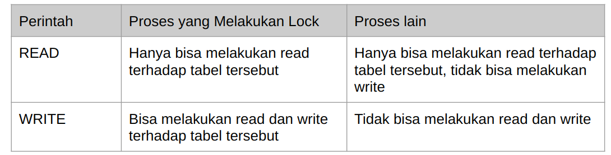
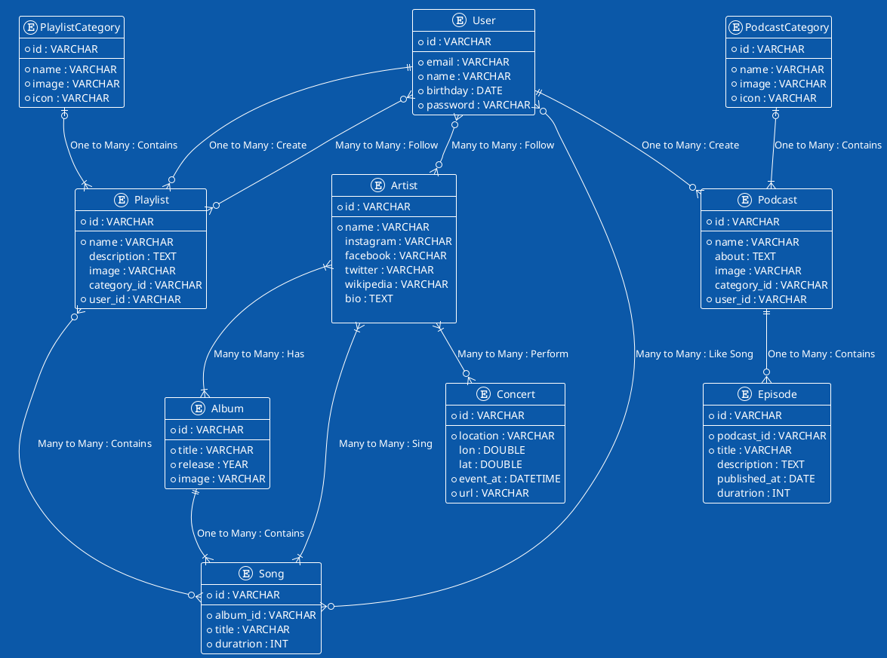

# mysql

sudo docker run --rm \       
--name=mysql-pzn-db \
-e MYSQL_DATABASE=mysqlpzn-db \
-e MYSQL_USER=yukbelajar \
-e MYSQL_PASSWORD=PNSJkxXvVNDAhePMuExTBuRR \
-e MYSQL_ROOT_PASSWORD=PNSJkxXvVNDAhePMuExTBuRR \
-e TZ=Asia/Jakarta \
-p 6603:3306 \
-v "$PWD/docker/mysql-pzn-db/conf.d":/etc/mysql/conf.d \
-v "$PWD/storage/docker/mysqlpzn-db-data":/var/lib/mysql \
mysql

# Locking 
- Locking adalah proses mengunci data di DBMS 
- Proses mengunci data sangat penting dilakukan, salah satunya agar data benar-benar terjamin konsistensinya 
- Karena pada kenyataannya, aplikasi yang akan kita buat pasti digunakan oleh banyak pengguna, dan banyak pengguna tersebut bisa saja akan mengakses data yang sama, jika tidak ada proses locking, bisa dipastikan akan terjadi RACE CONDITION, yaitu proses balapan ketika mengubah data yang sama 
- Contoh saja, ketika kita belanja di toko online, kita akan balapan membeli barang yang sama, jika data tidak terjaga, bisa jadi kita salah mengupdate stock karena pada saat yang bersamaan banyak yang melakukan perubahan stock barang

# Locking Record
- Saat kita melakukan proses TRANSACTION, lalu kita melakukan prose perubahan data, data yang kita ubah tersebut akan secara otomatis di LOCK 
- Hal ini membuat proses TRANSACTION sangat aman 
- Oleh karena itu, sangat disarankan untuk selalu menggunakan fitur TRANSACTION ketika memanipulasi data di database, terutama ketika perintah manipulasinya lebih dari satu kali 
- Locking ini akan membuat sebuah proses perubahan yang dilakukan oleh pihak lain akan diminta untuk menunggu 
- Data akan di lock sampai kita melakukan COMMIT atau ROLLBACK transaksi tersebut

# Locking Record Manual
- Selain secara otomatis, kadang saat kita membuat aplikasi, kita juga sering melakukan SELECT query terlebih dahulu sebelum melakukan proses UPDATE misalnya. 
- Jika kita ingin melakukan locking sebuah data secara manual, kita bisa tambahkan perintah FOR UPDATE di belakang query SELECT 
- Saat kita lock record yang kita select, maka jika ada proses lain akan melakukan UPDATE, DELETE atau SELECT FOR UPDATE lagi, maka proses lain diminta menunggu sampai kita selesai melakukan COMMIT atau ROLLBACK transaction

# Dead Lock
- Saat kita terlalu banyak melakukan proses Locking, hati-hati akan masalah yang bisa terjadi, yaitu DEADLOCK 
- Deadlock adalah situasi ada 2 proses yang saling menunggu satu sama lain, namun data yang ditunggu dua-duanya di lock oleh proses lainnya, sehingga proses menunggunya ini tidak akan pernah selesai.

# Contoh Deadlock
- Proses 1 melakukan SELECT FOR UPDATE untuk data 001 
- Proses 2 melakukan SELECT FOR UPDATE untuk data 002 
- Proses 1 melakukan SELECT FOR UPDATE untuk data 002, diminta menunggu karena di lock oleh Proses 2 
- Proses 2 melakukan SELECT FOR UPDATE untuk data 001, diminta menunggu karena di lock oleh Proses 1 
- Akhirnya Proses 1 dan Proses 2 saling menunggu 
- Deadlock terjadi

# Locking Table
- MySQL mendukung proses locking terhadap sebuah tabel
- Jika kita me lock table, artinya satu seluruh data di tabel tersebut akan di lock
- Ada 2 jenis lock table, yaitu READ dan WRITE
- Cara melakukan locking table adalah dengan perintah
  - LOCK TABLES nama_table READ;
  - LOCK TABLES nama_Table WRITE
- Setelah selesai melakukan lock table, kita bisa melakukan unlock dengan perintah : UNLOCK TABLES;

# Behaviour Lock Tables

# Locking Instance
- Salah satu fitur lock lainnya di MySQL adalah lock instance 
- Lock instance adalah perintah locking yang akan membuat perintah DDL (data definition language) akan diminta menunggu sampai proses unlock instance 
- Biasanya proses locking instance ini terjadi ketika misal kita ingin melakukan backup data, agar tidak terjadi perubahan terhadap struktur tabel misalnya, kita bisa melakukan locking instance 
- Setelah proses backup selesai, baru kita unlock lagi instance nya 
- Untuk melakukan locking instance, kita bisa gunakan perintah :
  - LOCK INSTANCE FOR BACKUP; 
- Untuk melakukan unlock instance, kita bisa gunakan perintah :
  - UNLOCK INSTANCE;

# User Management
## Root User
- Secara default, mysql membuat root user sebagai super administrator 
- Namun best practice nya, saat kita menjalankan MySQL dengan aplikasi yang kita buat, sangat disarankan tidak menggunakan user root 
- Lebih baik kita buat user khusus untuk tiap aplikasi, bahkan kita bisa batasi hak akses user tersebut, seperti hanya bisa melakukan SELECT, dan tidak boleh melakukan INSERT, UPDATE atau DELETE

## Hak Akses dan User
- Dalam user management MySQL, kita akan mengenal istilah Hak Akses dari User

## Daftar Hak Akses
- Ada banyak sekali hak akses di MySQL 
- Kita bisa melihatnya di daftar tabel yang terdapat di halaman berikut :
- https://dev.mysql.com/doc/refman/8.0/en/grant.html 

# Backup Database
- Saat membuat aplikasi menggunakan database, ada baiknya kita selalu melakukan backup data secara reguler 
- Untungnya MySQL mendukung proses backup database 
- Untuk melakukan backup database, kita tidak menggunakan perintah SQL, melainkan MySQL menyediakan sebuah aplikasi khusus untuk melakukan backup database, namanya adalah mysqldump
- https://dev.mysql.com/doc/refman/8.0/en/mysqldump.html 

# Restore Database
- Selain melakukan backup database, di MySQL juga kita bisa melakukan proses restore data dari file hasil backup
- Untuk melakukan restore database, kita bisa menggunakan aplikasi mysql client atau menggunakan perintah SOURCE di MySQL

